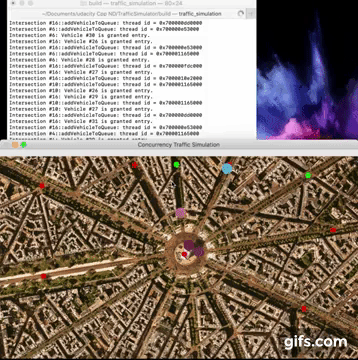

# Traffic Simulator
Intro: implementation of C++ concurrency programming.   

The map sets in Arc de Triomphe in Paris. An intersection is marked on each street, with an additional intersection at the center of the map. The big dots represent vehicles. Vehicles can enter the intersection anytime, but will only leave the intersection when the traffic light is green. Behind the scene, each intersection contains a `WaitingVehicles` and a `TrafficLight` object.  `WaitingVehicles` is an auxiliary class to queue and dequeue waiting vehicles in a thread-safe manner; `TrafficLight` provides random green or red lights that regulate vehicles' departure from the intersection.   

`Intersection` will spawn a thread to queue incoming vehicles using move semantics in the `WaitingVehicles` object, then spawns another thread to process the vehicles in the queue. The execution and access to  `Vehicle` objects are carefully handled with finely-grained locking and unlocking mechanism.  

## Dependencies for Running Locally
* cmake >= 2.8
* make >= 4.1 (Linux, Mac), 3.81 (Windows)
* OpenCV >= 4.1
* gcc/g++ >= 5.4

## Basic Build Instructions

1. Clone this repo.
2. Make a build directory in the top level directory: `mkdir build && cd build`
3. Compile: `cmake .. && make`
4. Run it: `./traffic_simulation`.
